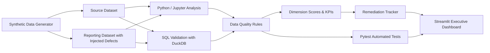
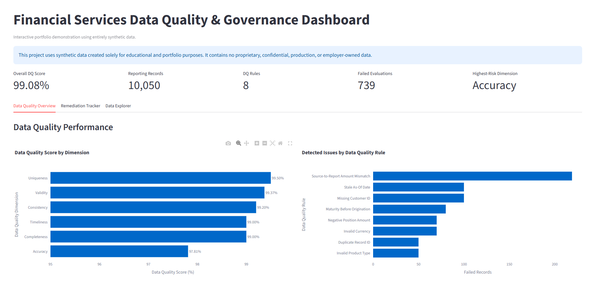
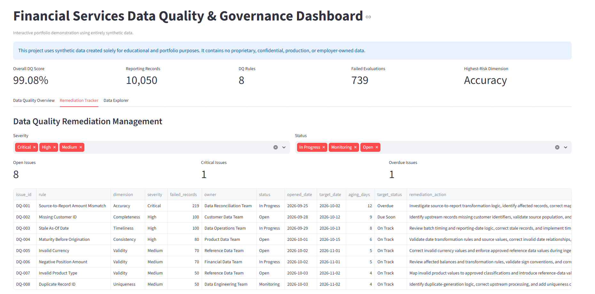
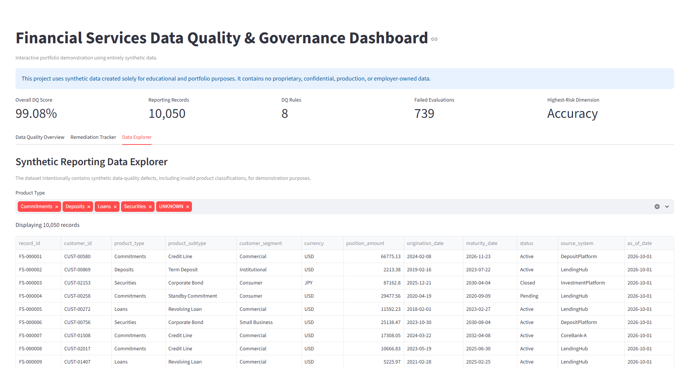

# Financial Services Data Quality & Governance Framework

An end-to-end portfolio project demonstrating data quality engineering, data governance, reconciliation, analytics, SQL validation, automated testing, remediation management, and executive reporting using entirely synthetic financial-services data.

> **Portfolio Disclaimer**
>
> This project uses entirely synthetic data generated solely for educational and portfolio purposes. It does not contain proprietary, confidential, production, or employer-owned data, code, schemas, screenshots, or internal business rules from any organization.

---

## Project Overview

Financial institutions and other data-intensive organizations depend on accurate, complete, timely, and consistent information for reporting, operations, risk management, analytics, and decision-making.

This project demonstrates a practical data-quality and governance framework that:

- Generates a synthetic financial-services dataset
- Introduces controlled data-quality defects
- Performs exploratory data analysis
- Implements rule-based data-quality validation
- Performs source-to-report reconciliation
- Validates results independently using SQL
- Uses automated tests to confirm control behavior
- Scores data quality across six dimensions
- Tracks remediation ownership and target dates
- Presents results through an interactive Streamlit dashboard

The synthetic portfolio includes:

- Loans
- Deposits
- Commitments
- Securities

---

## Key Results

The framework evaluates **10,050 reporting records** using **8 data-quality rules**.

| Metric | Result |
|---|---:|
| Overall Data Quality Score | **99.08%** |
| Reporting Records | **10,050** |
| Data Quality Rules | **8** |
| Failed Rule Evaluations | **739** |
| Highest-Risk Dimension | **Accuracy** |
| Automated Tests | **10 passed** |

### Data Quality Scores

| Dimension | Score |
|---|---:|
| Uniqueness | 99.50% |
| Validity | 99.37% |
| Consistency | 99.20% |
| Completeness | 99.00% |
| Timeliness | 99.00% |
| Accuracy | 97.81% |

The analysis identified **Accuracy** as the primary area requiring remediation, driven mainly by source-to-report amount reconciliation differences.

---

## Data Quality Rules

The framework evaluates several commonly used data-quality dimensions:

| Rule | Dimension |
|---|---|
| Missing Customer ID | Completeness |
| Invalid Currency | Validity |
| Negative Position Amount | Validity |
| Maturity Before Origination | Consistency |
| Invalid Product Type | Validity |
| Stale As-Of Date | Timeliness |
| Duplicate Record ID | Uniqueness |
| Source-to-Report Amount Mismatch | Accuracy |

A single record may fail more than one rule, so failed rule evaluations should not be interpreted as a count of unique defective records.

---

## Architecture

## Dashboard Preview

### Data Quality Overview

The executive overview summarizes overall data quality performance, rule failures, dimension-level scores, and the highest-risk area.

### Remediation Tracker

The remediation view translates detected issues into governance actions by assigning severity, ownership, status, aging, and target dates.

### Data Explorer

The interactive data explorer enables review of the synthetic reporting population by product type and provides visibility into intentionally injected data-quality defects.

